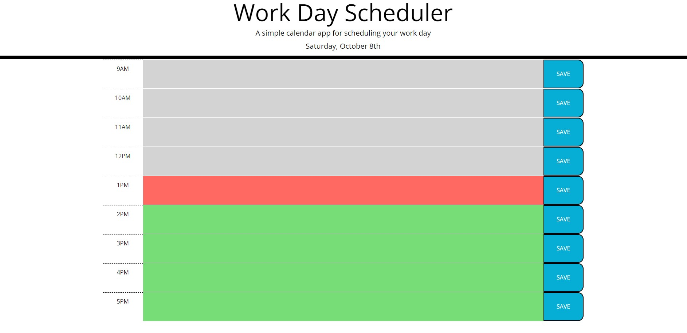

# 04-Module-Challenge

### Third-Party APIs Challenge: Work Day Scheduler

---

## Work Day Scheduler

[Work Day Scheduler]("https://josejpd3.github.io/05-Module-Challenge/") is a useful tool to structure important tasks that need be completed. This scheduler allows you to easily view the current date and distinguish previous, current, and upcoming tasks depending on the time of the day.

---

You can easily enter a task inside text area located in the center of every row, and press save in order to store your new tasks. Your saved tasks are then available even after starting a new session.
